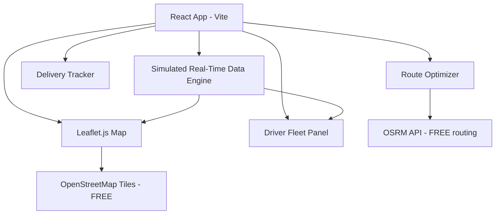

# PKC LLC Fleet Dispatcher Dashboard

Transform the existing FleetOS driver-view prototype into a **PKC LLC Fleet Control Center** — a dispatcher-facing dashboard with real maps, live driver tracking, route optimization, and delivery management across the United States.

## Architecture Overview

## Technology Stack

| Layer | Technology | Cost |
|-------|-----------|------|
| **Maps** | Leaflet.js + OpenStreetMap tiles | **Free** |
| **Routing** | OSRM (Open Source Routing Machine) API | **Free** |
| **Geocoding** | Nominatim (OpenStreetMap) | **Free** |
| **Frontend** | React 18 + Vite (existing project) | Existing |
| **Styling** | Vanilla CSS (dark fleet theme from provided HTML) | — |
| **Real-time Sim** | JavaScript intervals simulating driver movement | — |

> [!NOTE]
> All APIs used are **completely free** with no API keys required. OSRM provides real road-based routing with actual distances and ETAs. OpenStreetMap provides full US road maps.

## Open Questions

> [!IMPORTANT]
> **Replacing or coexisting?** This will replace the existing NBA odds app content in `App.jsx` and `index.css`. The NBA app code will be overwritten. Is that acceptable, or should I create this in a separate directory?

> [!IMPORTANT]
> **Driver data:** I'll simulate 8-12 CDL drivers with realistic US routes (e.g., Dallas→Chicago, LA→Atlanta, etc.) with real OSRM-calculated routes. The drivers will move along these routes in real-time simulation. Does this approach work?

## Proposed Changes

### Core Application

#### [MODIFY] [package.json](file:///c:/Users/chryz/Downloads/nba-odds-app/package.json)
- Add `leaflet` and `react-leaflet` dependencies for interactive maps
- Add `leaflet-routing-machine` for route display
- Update app name to `pkc-fleet-dashboard`

---

#### [MODIFY] [index.html](file:///c:/Users/chryz/Downloads/nba-odds-app/index.html)
- Update title to "PKC LLC — Fleet Control Center"
- Add Leaflet CSS CDN link
- Add Google Fonts (Oswald, Barlow Condensed, Share Tech Mono)

---

#### [MODIFY] [index.css](file:///c:/Users/chryz/Downloads/nba-odds-app/src/index.css)
Complete rewrite with the dark fleet command-center theme:
- CSS custom properties for colors (amber, teal, red accents on dark bg)
- HUD-style header bar with PKC LLC branding
- Card components, status indicators, animated dots
- Map container styles
- Driver list/grid styles
- Route panel styles
- Responsive breakpoints

---

#### [MODIFY] [App.jsx](file:///c:/Users/chryz/Downloads/nba-odds-app/src/App.jsx)
Complete rewrite as the PKC LLC Fleet Dashboard. Major sections:

**1. Real-Time Fleet Map (Main View)**
- Full interactive Leaflet map of the United States
- Driver truck icons positioned on actual road coordinates
- Click a driver to see their route highlighted on the map
- Color-coded markers: 🟢 Active, 🟡 On Break, 🔴 Off Duty, 🔵 At Delivery
- Real OSRM routes drawn as polylines on the map

**2. Driver Fleet Panel (Left Sidebar)**
- List of all drivers with real-time status
- Each driver card shows:
  - Name, CDL number, truck ID
  - Current status (Driving / On Break / Sleeper / Off Duty)
  - Hours worked today / this week (HOS compliance)
  - Route progress bar (% of delivery complete)
  - Weeks willing to stay out vs. weeks already out
  - Current city/location
  - ETA to next delivery

**3. Route Optimizer (Right Panel / Modal)**
- Input origin and destination (US cities)
- Calls OSRM API for real shortest/fastest route
- Displays distance (miles), estimated drive time, fuel estimate
- Shows route on the map with turn-by-turn waypoints
- Compares fastest vs shortest route options

**4. Delivery Tracker**
- Active deliveries across the US
- Pickup/dropoff locations with real addresses
- Status: Pending → In Transit → Delivered
- Distance remaining, ETA
- Delivery history log

**5. Dispatcher Communication Panel**
- Message feed from drivers
- Alert system for HOS violations, mechanical issues
- Quick-action buttons for rerouting, status updates

---

### Data & Simulation Engine

#### [NEW] [driverData.js](file:///c:/Users/chryz/Downloads/nba-odds-app/src/driverData.js)
Simulated fleet of 10 drivers with:
- Realistic US routes (real city coordinates)
- Route waypoints along actual highways
- HOS timers (drive time, on-duty time, break timers)
- Weeks out preferences (2-6 weeks)
- Current progress along route (0-100%)
- Vehicle info (truck number, trailer type)
- Delivery manifest data

#### [NEW] [routeService.js](file:///c:/Users/chryz/Downloads/nba-odds-app/src/routeService.js)
API integration module:
- `getRoute(origin, destination)` → calls OSRM `/route/v1/driving/` 
- `getDistance(coords1, coords2)` → haversine + road distance
- `reverseGeocode(lat, lng)` → calls Nominatim for city names
- `interpolatePosition(route, progress)` → calculate driver position along route
- Response parsing for distance, duration, geometry (polyline)

---

## Key Features Detail

### 🗺️ Interactive Fleet Map
- Leaflet.js with OpenStreetMap tiles (dark theme: CartoDB Dark Matter)
- All drivers shown as custom truck markers
- Click driver → route polyline appears on map
- Smooth marker animation as drivers "move" along routes
- Delivery waypoints shown as destination markers

### 📊 Driver Status Board
| Field | Source |
|-------|--------|
| Location | OSRM route interpolation + reverse geocode |
| Miles driven | OSRM distance calculation |
| Miles remaining | Total route - driven |
| ETA | OSRM duration estimate |
| HOS remaining | Simulated countdown timer |
| Weeks out | Simulated preference vs actual |
| Route progress | % of total route completed |

### 🛣️ Route Finder
- Type any two US cities
- OSRM calculates **actual road route** (not straight line)
- Returns real distance in miles, drive time in hours
- Draws the route on the map
- Shows fuel cost estimate (based on MPG)

### 📦 Delivery Management
- 20+ delivery locations across the US
- Each with real coordinates and city names
- Status tracking with timestamps
- Distance-to-delivery calculation

## Verification Plan

### Automated Tests
- Run `npm run dev` and verify the app loads
- Test OSRM API calls return valid routes
- Verify map renders with all driver markers
- Test route calculation between sample cities

### Manual Verification
- Visual inspection of map with driver positions
- Click through all dashboard panels
- Verify driver data updates in real-time
- Test route optimizer with various US city pairs
- Check responsive layout on different screen sizes
- Create a browser recording demonstrating the full dashboard
